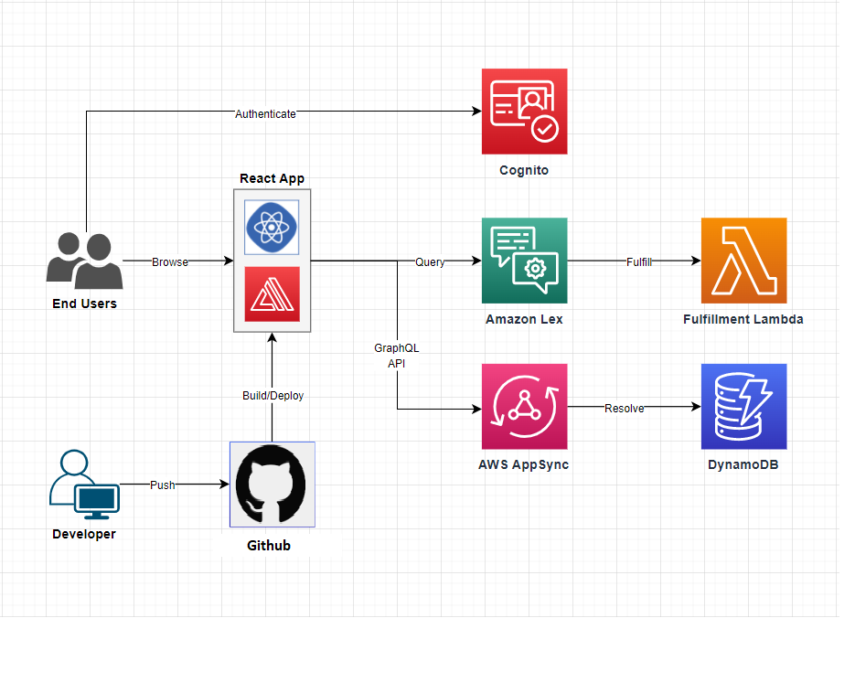

# Serverless Conversational AI Assistant with AWS Amplify & Amazon Lex


## Table of Contents
1. [Project Overview](#project-overview)
2. [Prerequisites](#prerequisites)
3. [Initial Setup](#initial-setup)
4. [Authentication Configuration](#authentication-configuration)
5. [GraphQL API Setup](#graphql-api-setup)
6. [Amazon Lex Bot Integration](#amazon-lex-bot-integration)
7. [Frontend Implementation](#frontend-implementation)
8. [Deployment](#deployment)
9. [Troubleshooting](#troubleshooting)


---

## Project Overview
A serverless web application that enables natural language interactions with AWS services through a conversational AI interface powered by Amazon Lex.

**Key Features:**
- User authentication via Amazon Cognito
- Natural language processing with Amazon Lex
- AWS operations through chat (EC2, S3 management)
- Conversation history tracking with GraphQL API
- Responsive React.js frontend

---

## Prerequisites

### Software Requirements
- AWS Account with Administrator permissions
- Node.js 18.x or later
- npm/yarn package manager
- Git version control

### AWS Services Setup
1. Install AWS Amplify CLI:
   ```bash
   npm install -g @aws-amplify/cli
   amplify configure
   ```
2. Configure IAM user with:
   - AmazonLexFullAccess
   - AWSAmplifyConsoleFullAccess
   - AmazonDynamoDBFullAccess

---

## Initial Setup

### 1. Clone Repository
```bash
git clone <repository-url>
cd <project-directory>
```

### 2. Initialize Amplify Project
```bash
amplify init
```
- Select environment: **dev**
- Choose Amplify Gen1
- Configure build settings:
  - Distribution directory: `dist`
  - Build command: `npm run build`
  - Start command: `npm run dev`

### 3. Install Dependencies
```bash
npm install
```

---

## Authentication Configuration

```bash
amplify add auth
```
- Select: **Default configuration**
- Choose authentication method: **Email**
- Advanced settings: **No, I am done**

---

## GraphQL API Setup

### 1. Create API
```bash
amplify add api
```
- Service type: **GraphQL**
- Authorization: **Amazon Cognito User Pool**
- Enable conflict detection: **Yes**
- Resolution strategy: **Auto Merge**
- Template: **Blank Schema**

### 2. Schema Definition
```graphql
type Conversation @model @auth(rules: [{ allow: owner }]) {
  id: ID!
  name: String!
  description: String
  user: String! @index(name: "byUser", queryField: "conversationsByUser")
  utterances: [Utterance] @hasMany(indexName: "byConversation", fields: ["id"])
  createdAt: AWSDateTime!
}

type Utterance @model @auth(rules: [{ allow: owner }]) {
  id: ID!
  text: String!
  isBot: Boolean!
  conversationId: ID! @index(name: "byConversation", sortKeyFields: ["createdAt"])
  createdAt: AWSDateTime!
}
```

### 3. Generate Client Code
```bash
amplify codegen add
```
This creates:
- GraphQL queries/mutations in `src/graphql`
- JavaScript types for all schema types
- AWS AppSync client configuration

---

## Amazon Lex Bot Integration

### 1. Create Lex Bot
1. Go to AWS Lex Console
2. Create new bot:
   - Name: `CloudAssistantBot`
   - Runtime role: **Create new role**
   - Session timeout: 5 minutes

### 2.  Configure Intents

Below are the essential Amazon Lex V2 intents your bot should support, with detailed configuration using `AMAZON.AlphaNumeric` slots.

---

####  `ListEC2Instances`

**Purpose:** Lists all running EC2 instances in a specified region.

- **Sample Utterances:**
  - "List my EC2 instances"
  - "Show all servers"
  - "What instances are running?"
  - "Get EC2 status in us-east-1"

- **Slots:**
  - `Region` (Optional)  
    - **Slot Type:** `AMAZON.AlphaNumeric`  
    - **Prompt:** "Which AWS region should I check? (e.g., us-east-1)"
    - **Sample Values:** `us-east-1`, `us-west-2`, `eu-central-1`
    - **Validation Tip:** Add Lambda validation to check if the entered region is valid

- **Response Messages:**
  - Success: "Here are your EC2 instances in {Region}."
  - Failure: "I couldn't fetch instances for that region. Please try again."

- **Fulfillment:** Lambda function using `DescribeInstances`

---

####  `TerminateEC2Instance`

**Purpose:** Terminates a specific EC2 instance.

- **Sample Utterances:**
  - "Terminate instance i-1234567890abcdef0"
  - "Stop instance i-abc123"
  - "Shutdown EC2 instance"

- **Slots:**
  - `InstanceId` (Required)  
    - **Slot Type:** `AMAZON.AlphaNumeric`  
    - **Prompt:** "What is the EC2 instance ID you'd like to terminate?"

- **Confirmation Prompt:**  
  - "Are you sure you want to terminate instance {InstanceId}? This action is irreversible."

- **Decline Response:**  
  - "Okay, the instance will not be terminated."

- **Response Messages:**
  - Success: "Instance {InstanceId} has been terminated."
  - Failure: "Could not terminate the instance. Please check the instance ID and try again."

- **Fulfillment:** Lambda function using `TerminateInstances`

---

#### `ListS3Buckets`

**Purpose:** Lists all S3 buckets in your account.

- **Sample Utterances:**
  - "List my S3 buckets"
  - "Show all buckets"
  - "What buckets do I have?"

- **Slots:** None

- **Response Messages:**
  - Success: "Here are your S3 buckets: [bucket names]"
  - Failure: "Sorry, I couldn't retrieve the buckets right now."

- **Fulfillment:** Lambda function using `ListBuckets`

---

####  `HelpIntent`

**Purpose:** Offers guidance on using the assistant.

- **Sample Utterances:**
  - "Help"
  - "What can you do?"
  - "Show me commands"

- **Response Message:**
  - "I can help you interact with AWS using natural language. For example, say 'List EC2 instances', 'Show S3 buckets', or 'Terminate EC2 instance'."

---

####  `FallbackIntent`

**Purpose:** Captures unexpected or unsupported user input.

- **Sample Utterances:** Automatically handled by Lex

- **Response Message:**
  - "I'm not sure what you meant. Try asking me to 'list EC2 instances' or say 'help' to see more options."

---

> **Note:** Since you're using `AMAZON.AlphaNumeric`, ensure the Lambda fulfillment code validates slot values (e.g., valid AWS regions or instance ID patterns) before taking action.


### 3. Connect Lambda Functions
For all intents:
1. Create Lambda router function
2. Add as fulfillment handler
3. You can copy all of intent fucntions in the lambda handler in folder lambdaFunction/intents/... to your aws console lambda configuration

---

## Frontend Implementation

### Key Components
1. **Chat Interface** (`ChatPage.js`)
   - Handles conversation flow
   - Integrates with Lex service
   - Manages conversation history

2. **Lex Service** (`lexService.js`)
   ```javascript
   import { LexRuntimeV2Client, RecognizeTextCommand } from "@aws-sdk/client-lex-runtime-v2";
   
   const lexClient = new LexRuntimeV2Client({ region: "eu-west-1" });
   
   export const sendMessageToLex = async (message) => {
     const params = {
       botId: "<YOUR_BOT_ID>",
       botAliasId: "<YOUR_ALIAS_ID>",
       localeId: "en_US",
       sessionId: "current-user-session",
       text: message
     };
     
     const command = new RecognizeTextCommand(params);
     const response = await lexClient.send(command);
     return response.messages[0].content;
   };
   ```

---

## Deployment

### 1. Connect GitHub Repository
1. Go to AWS Amplify Console
2. Select "Connect app"
3. Authorize GitHub account
4. Select repository and branch

### 2. Configure Build Settings
- Build command: `npm run build`
- Base directory: `/`
- Output directory: `dist`

### 3. Set Environment Variables
Add required variables:
- `REACT_APP_LEX_BOT_ID`
- `REACT_APP_LEX_BOT_ALIAS_ID`
- `REACT_APP_AWS_REGION`

---


##  Troubleshooting

### Common Issues

---

### 1.  Lex Access Denied Errors

```

Error: AccessDeniedException: User is not authorized to perform: lex\:RecognizeText

````

**Solution:**

Add **Lex permissions** to the **Cognito Auth Role**:

```json
{
  "Version": "2012-10-17",
  "Statement": [
    {
      "Effect": "Allow",
      "Action": [
        "lex:RecognizeText",
        "lex:RecognizeUtterance"
      ],
      "Resource": [
        "arn:aws:lex:<region>:<account>:bot/<bot-id>",
        "arn:aws:lex:<region>:<account>:bot-alias/<bot-id>/<alias-id>"
      ]
    }
  ]
}
````

---

### 2.  GraphQL Schema Errors

* Changes in the schema are not reflected in the frontend.
* You see missing types or resolvers in the client.

**Solution:**

* Run the following command:

  ```bash
  amplify codegen models
  ```
* Double-check your `@auth` directives and ensure they're valid.
* Re-deploy the backend:

  ```bash
  amplify push
  ```

---

### 3.  Lambda Function Permission Errors

```
AccessDeniedException: User is not authorized to perform: <aws-service>
```

**Solution:**

Ensure your **Lambda execution role** includes permissions for the AWS services it needs. Example policy:

```json
{
  "Version": "2012-10-17",
  "Statement": [
    {
      "Effect": "Allow",
      "Action": [
        "ec2:DescribeInstances",
        "s3:ListAllMyBuckets"
      ],
      "Resource": "*"
    }
  ]
}
```

Attach this policy to your Lambda role (e.g., `CloudAssistantLambdaRole`).

---

### 4.  Cognito Auth Role Missing Permissions

* Users cannot access backend or Lex after logging in.

**Solution:**

Attach missing policies to the **Cognito Auth Role**. Example:

```json
{
  "Version": "2012-10-17",
  "Statement": [
    {
      "Effect": "Allow",
      "Action": [
        "appsync:GraphQL",
        "lex:RecognizeText"
      ],
      "Resource": "*"
    }
  ]
}
```

---

### 5.  Amplify Push Stuck or Fails

```
✖ An error occurred when pushing the resources to the cloud
```

**Solution:**

* Run `amplify status` to see pending changes.
* Try `amplify pull --restore` to sync with the cloud environment.
* Use `amplify env checkout <env-name>` to switch and recover environments.

---

### 6.  CORS Issues on API Calls

* API requests from the frontend are blocked.

**Solution:**

Ensure AppSync has CORS configured if you're using a custom domain.

For Lambda via API Gateway, check headers:

```js
return {
  statusCode: 200,
  headers: {
    "Access-Control-Allow-Origin": "*",
    "Access-Control-Allow-Headers": "*"
  },
  body: JSON.stringify(response)
};
```


---
## Example Commands

#### EC2 Instance Commands
```
> Show ec2 instances
> EC
> List ec2 instances
> Terminate EC2 Instance {InstanceId}

```


#### S3 Commands
```
> Show me all my S3 buckets
> Terminate S3 Bucket {BucketName}
```


## Cleanup
To cleanup all created resources, perform the following: 
- Navigate to the Amplify console, select the “your-assistant-app-name” app, click the Actions dropdown and select “Delete App”
- Navigate to the Amazon Lex console, select the assistant bot, click the Actions dropdown, and select “Delete”

## Conclusion
This documentation provides a comprehensive guide to setting up a serverless conversational AI assistant using AWS Amplify and Amazon Lex. 
Deployment URL : https://main.d23563c04xwzx3.amplifyapp.com/chat
For additional support, refer to:

- [AWS Amplify Documentation](https://docs.amplify.aws/)
- [Amazon Lex Developer Guide](https://docs.aws.amazon.com/lexv2/latest/dg/what-is.html)
- [AWS AppSync GraphQL API Reference](https://docs.aws.amazon.com/appsync/latest/devguide/welcome.html)


